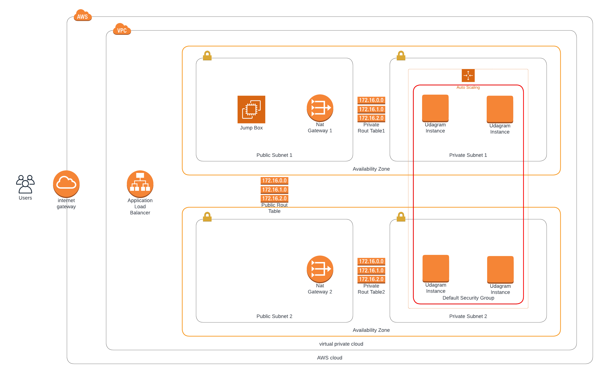

## Project Title - Deploy a high-availability web app using CloudFormation
This project deploys the infrastructure and application for an Instagram-like app from the ground up. You will begin with deploying the networking components, followed by servers, security roles and software.

### Infrastructure Diagram

