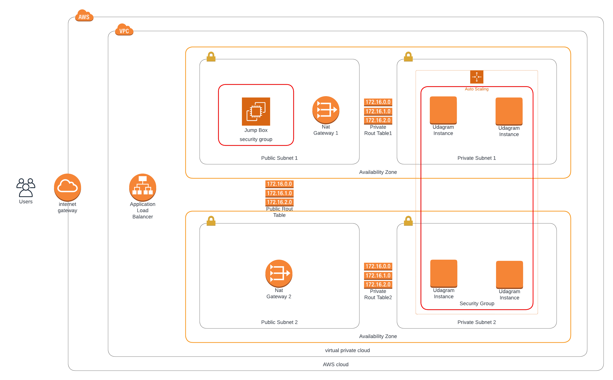

## Project Title - Deploy a high-availability web app using CloudFormation
This project deploys the infrastructure and application for an Instagram-like app from the ground up. You will begin with deploying the networking components, followed by servers, security roles and software.
To verify the application is working, [click here!](http://serve-WebAp-1A4UPMDVQDBDF-1234618749.us-east-1.elb.amazonaws.com)

### Infrastructure Diagram

### Bonus
- The public DNS Name of the Load Balancer with "http" in front of it, is exported in the Output section of the template.
- A bastion host is set up on the Public Subnet 1 with port 22 open only to my home IP address. Note that I removed my actual public IP from the final tempalte for security reasons.

